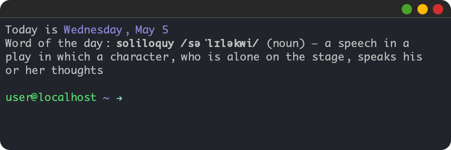

# Soliloquy

It is a command-line word-of-the-day-type application with a built-in dictionary of unusual, archaic, formal and rarely used English words. Currently, it consists of 69 definitions but is going to grow.



## Prerequisites

-   Python 3

## Usage

```bash
python soliloquy.py
```

## Flags

| Flag | Description         | Default      | Notes                      |
| ---- | ------------------- | ------------ | -------------------------- |
| `-n` | Don't use cache     | False        | May be used for testing    |
| `-d` | Specify date format | "%A, %B %-d" | Use "" to not display date |

## Contributing

Pull requests are welcome: both for the code part and the dictionary. For major changes, please open an issue first to discuss what you would like to change.

## License

[MIT](LICENSE)
